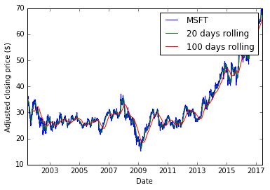

# Alternative to Python for Finance, Part 1

[Here](http://www.learndatasci.com/python-finance-part-yahoo-finance-api-pandas-matplotlib/) is the original website. The original text is copied from the source.

***

## Getting the Data

Pandas is included in the more popular distributions of Python for Windows, such as Anaconda. In case it's not included in your Python distribution, use pip: `pip install pandas`. Once installed, to use pandas, all one needs to do is import it. We will also need the `pandas_datareader` package (`pip install pandas-datareader`), as well as `matplotlib` (`pip install matplotlib`) for visualizing our results.


```python
# Import relevant modules
from pandas_datareader import data
import matplotlib.pyplot as plt
import pandas as pd
import time
```

Having imported the appropriate tools, getting market data from a free online source, such as Yahoo Finance, is super easy. Since pandas has a simple remote data access for the Yahoo Finance API data, this is as simple as:


```python
# Define the instruments to download. We would like to see Apple, Microsoft and the S&P500 index.
tickers = ['AAPL', 'MSFT', 'SP']

# We would like all available data from 01/01/2000 until today.
today = time.strftime("%Y-%m-%d")
start_date = '2000-01-01'

# User pandas_reader.data.DataReader to load the desired data. As simple as that.
panel_data = data.DataReader(tickers, "google", start_date, today)
```

What does `panel_data` look like? `data.DataReader` returns a Panel object, which can be thought of as a 3D matrix. The first dimension consists of the various fields Yahoo Finance returns for a given instrument, namely, the *Open, High, Low, Close* and *Adj Close* prices for each date. The second dimension contain the dates. The third one contains the instrument identifiers.

Let's see what `panel_data` actually is:


```python
panel_data
```


    <class 'pandas.core.panel.Panel'>
    Dimensions: 5 (items) x 4000 (major_axis) x 3 (minor_axis)
    Items axis: Open to Volume
    Major_axis axis: 2001-07-02 00:00:00 to 2017-05-26 00:00:00
    Minor_axis axis: AAPL to SP


## Preparing the Data

Let us assume we are interested in working with the *Adj Close* prices <sup>[1](#footnote1)</sup> which have been already been adjusted by Yahoo finance to account for corporate actions such as dividends and stock splits. We want to make sure that all weekdays are included in our dataset, which is very often desirable for quantitative trading strategies. Of course, some of the weekdays might be public holidays in which case no price will be available. For this reason, we will fill the missing prices with the latest available prices. All this is, again, all too easy with pandas:

<a name="footnote1">1</a>: This is from the old script that uses *Yahoo!*. *Google Finance* only has "Close" prices - not "Adj Close".


```python
# Getting just the adjusted closing prices. This will return a Pandas DataFrame
# The index in this DataFrame is the major index of the panel_data.
adj_close = panel_data.ix['Close']

# Getting all weekdays between 01/01/2000 and today
all_weekdays = pd.date_range(start=start_date, end=today, freq='B')

# How do we align the existing prices in adj_close with our new set of dates?
# All we need to do is reindex adj_close using all_weekdays as the new index
adj_close = adj_close.reindex(all_weekdays)

# Reindexing will insert missing values (NaN) for the dates that were not present
# in the original set. To cope with this, we can fill the missing by replacing them
# with the latest available price for each instrument.
adj_close = adj_close.fillna(method='ffill')
```

Initially, `adj_close` contains all the adjusted closing prices for all instruments and all the dates that Yahoo returned. Some of the week days might be missing from the data Yahoo provides. For this reason we create a Series of all the weekdays between the first and last date of interest and store them in the all_weekdays variable. Getting all the weekdays is achieved by passing the `freq=’B’` named parameter to the `pd.date_range()` function. This function return a `DatetimeIndex` which is shown below:


```python
all_weekdays
```


    DatetimeIndex(['2000-01-03', '2000-01-04', '2000-01-05', '2000-01-06',
                   '2000-01-07', '2000-01-10', '2000-01-11', '2000-01-12',
                   '2000-01-13', '2000-01-14',
                   ...
                   '2017-05-15', '2017-05-16', '2017-05-17', '2017-05-18',
                   '2017-05-19', '2017-05-22', '2017-05-23', '2017-05-24',
                   '2017-05-25', '2017-05-26'],
                  dtype='datetime64[ns]', length=4540, freq='B')


Aligning the original DataFrame with the new DatetimeIndex is accomplished by substitution of the initial DatetimeIndex of the `adj_close` DataFrame. If any of the new dates were not included in the original DatetimeIndex, the prices for that date will be filled with NaNs. For this reason, we will fill any resulting NaNs with the last available price. The final, clean DataFrame is shown below:


```python
adj_close.tail()
```


<div>
<table border="1" class="dataframe">
  <thead>
    <tr style="text-align: right;">
      <th></th>
      <th>AAPL</th>
      <th>MSFT</th>
      <th>SP</th>
    </tr>
  </thead>
  <tbody>
    <tr>
      <th>2017-05-22</th>
      <td>153.99</td>
      <td>68.45</td>
      <td>29.20</td>
    </tr>
    <tr>
      <th>2017-05-23</th>
      <td>153.80</td>
      <td>68.68</td>
      <td>29.10</td>
    </tr>
    <tr>
      <th>2017-05-24</th>
      <td>153.34</td>
      <td>68.77</td>
      <td>29.40</td>
    </tr>
    <tr>
      <th>2017-05-25</th>
      <td>153.87</td>
      <td>69.62</td>
      <td>29.25</td>
    </tr>
    <tr>
      <th>2017-05-26</th>
      <td>153.61</td>
      <td>69.96</td>
      <td>29.40</td>
    </tr>
  </tbody>
</table>
</div>


## Looking at the Data

Our dataset is now complete and free of missing values. We can see a summary of the values in each of the instrument by calling the `describe()` method of a Pandas DataFrame:


```python
adj_close.describe()
```


<div>
<table border="1" class="dataframe">
  <thead>
    <tr style="text-align: right;">
      <th></th>
      <th>AAPL</th>
      <th>MSFT</th>
      <th>SP</th>
    </tr>
  </thead>
  <tbody>
    <tr>
      <th>count</th>
      <td>4150.000000</td>
      <td>4150.000000</td>
      <td>3392.00000</td>
    </tr>
    <tr>
      <th>mean</th>
      <td>43.580749</td>
      <td>32.358166</td>
      <td>22.34235</td>
    </tr>
    <tr>
      <th>std</th>
      <td>42.403515</td>
      <td>10.556675</td>
      <td>6.81715</td>
    </tr>
    <tr>
      <th>min</th>
      <td>0.940000</td>
      <td>15.150000</td>
      <td>11.98000</td>
    </tr>
    <tr>
      <th>25%</th>
      <td>6.090000</td>
      <td>25.960000</td>
      <td>17.20000</td>
    </tr>
    <tr>
      <th>50%</th>
      <td>25.715000</td>
      <td>28.280000</td>
      <td>21.17000</td>
    </tr>
    <tr>
      <th>75%</th>
      <td>77.620000</td>
      <td>34.277500</td>
      <td>24.96000</td>
    </tr>
    <tr>
      <th>max</th>
      <td>156.100000</td>
      <td>69.960000</td>
      <td>49.95000</td>
    </tr>
  </tbody>
</table>
</div>


Suppose we would like to plot the **MSFT time-series**. We would also like to see how the stock behaves compared to a short and longer term moving average of its price. A simple moving average of the original time-series is calculated by taking for each date the average of the last *W* prices (including the price on the date of interest). pandas has `rolling()`, a built in function for Series which returns a **rolling object** for a user-defined window, e.g. 20 days. Once a rolling object has been obtained, a number of functions can be applied on it, such as `sum()`, `std()` (to calculate the standard deviation of the values in the window) or `mean()`. See below:


```python
# Get the MSFT time series. This now returns a Pandas Series object indexed by date.
msft = adj_close.ix[:, 'MSFT']

# Calculate the 20 and 100 days moving averages of the closing prices
short_rolling_msft = msft.rolling(window=20).mean()
long_rolling_msft = msft.rolling(window=100).mean()

# Plot everything by leveraging the very powerful matplotlib package
fig = plt.figure()
ax = fig.add_subplot(1,1,1)
ax.plot(msft.index, msft, label='MSFT')
ax.plot(short_rolling_msft.index, short_rolling_msft, label='20 days rolling')
ax.plot(long_rolling_msft.index, long_rolling_msft, label='100 days rolling')
ax.set_xlabel('Date')
ax.set_ylabel('Adjusted closing price ($)')
ax.legend()
```


    <matplotlib.legend.Legend at 0x13cef70>


Now, finally the stock price history together with the two moving averages plotted:


